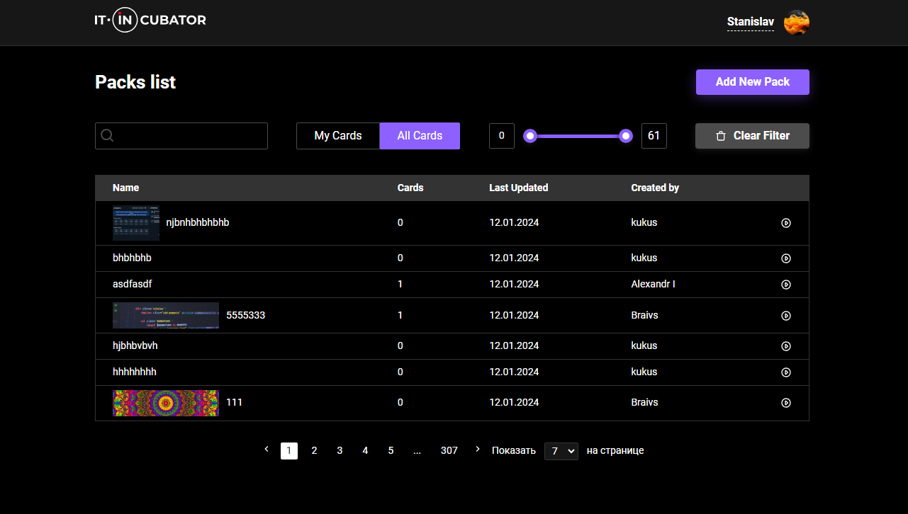

# [**Flash Cards**](https://flashcards-project-kappa.vercel.app/)

 

## Key Skills:

- Welcome to our Flash Cards project, an innovative card-based learning application. Our development team has focused on
  creating a powerful and easy to use tool that will help you memorise information effectively and improve your learning
  efficiency.

- One of the key technologies we used in the project is RTK Query. This library allows us to communicate with the server
  easily and efficiently, ensuring the application runs reliably and smoothly. RTK Query makes it easy to create API
  requests, manage data caching and update the application state, making development more efficient and convenient.

- We also chose React, one of the most popular libraries for user interface development. React provides easy and
  efficient
  component creation, allowing us to create dynamic and responsive interfaces for our application. With its virtual DOM,
  React provides fast rendering of components and improves the performance of the application.

- We used TypeScript to type our code. TypeScript adds static typing to JavaScript, which prevents many bugs early in
  development. With TypeScript, we can greatly improve the reliability and maintainability of our code, as well as
  improve
  the development process as a team.

- To manage forms in our application, we have applied React Hook Form. This library provides a simple and easy-to-use
  API for working with forms, allowing us to manage form state, input validation and data submission. React Hook Form
  helps us create interactive forms with minimal code and improves the user experience.

- We are proud of the results of our Flash Cards project and believe it is a powerful learning tool. Our development
  team
  has put in all their efforts to create an intuitive and effective product using RTK Query, React, TypeScript and React
  Hook Form technologies. We hope this app will help you reach new levels of knowledge and achievement!

## Technologies

- TypeScript
- React
- RTK Query
- React Hook Form 
- SCSS
- Vite

## Installation and launch of the project

- Clone the repository to your local computer.
- Install depending on the command pnpm install.
- Start the project by running pnpm dev.
- Open your web browser and check the address http://localhost:3000.

 
 

### You can register and view all project features, or
### Use your general test account credentials to sign in:

 

##### Email: testFlashCards@yandex.ru

##### Password: free1111111

 

## Utilization

### [**Task Assistant**](https://flashcards-project-kappa.vercel.app/)

## Contribution to the project

We welcome input from the community and would be happy to accept your suggestions for improving the project. If you have
any ideas, bug fixes or new features, please create a pull request or let us know.

## Contacts

If you have any questions or require additional information, please contact us using the following contact information:

Email: [skhurtov.work@yandex.ru](skhurtov.work@yandex.ru)

Thank you for your interest in our project!
